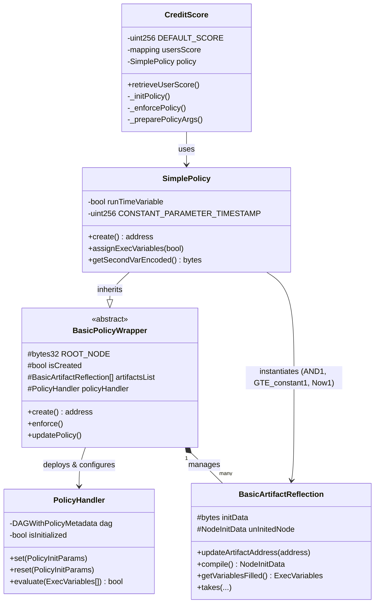

# Integration Guide: Onchain Policy Creation

This guide demonstrates how to integrate `BasicPolicyWrapper.sol` to create a `SimplePolicy.sol` smart contract, which is then used in a consumer contract like `CreditScore.sol`. The policy implements the rule: `(now >= uint256-constant) && bool-variable`.

---

## 1. Contract Architecture

The following UML object diagram illustrates the architecture of `SimplePolicy.sol` and its relationships with other core components.



---

## 2. Integration Guide

This section provides step-by-step instructions for creating `SimplePolicy.sol` using the policy toolchain.

### Step 1: Define the Policy Contract

Create a new contract that inherits from `BasicPolicyWrapper`. Define your runtime variables and constants.

```solidity
//SPDX-License-Identifier: Unlicensed
pragma solidity ^0.8.27;

import { BasicPolicyWrapper } from "./inheritance/BasicPolicyWrapper.sol";
import { AND1 } from "./remappings/AND1.sol";
import { GTE_constant1 } from "./remappings/GTE_constant1.sol";
import { Now1 } from "./remappings/Now1.sol";
import { AND } from "../../pre-defined/common/logical/AndBool.sol";
import { GteUint } from "../../pre-defined/common/comparison/GteUint.sol";
import { BasicTimeSource } from "../../pre-defined/common/utils/BasicTimeSource.sol";

contract SimplePolicy is BasicPolicyWrapper {
    bool private runTimeVariable;
    uint256 private constant CONSTANT_PARAMETER_TIMESTAMP = 1780093595;

    constructor() {
        isCreated = false;
    }
    // ...
}
```

### Step 2: Override the `create()` Method

Instantiate the required artifact reflections (`BasicArtifactReflection`), link them to their underlying logic contracts, and define the execution tree.

```solidity
    function create() public override returns (address) {
        // 1. Create artifact instances
        AND1 and1 = new AND1();
        and1.updateArtifactAddress(address(new AND()));

        GTE_constant1 gte_constant1 = new GTE_constant1();
        gte_constant1.updateArtifactAddress(address(new GteUint()));

        Now1 now1 = new Now1();
        now1.updateArtifactAddress(address(new BasicTimeSource()));

        // 2. Add artifacts to the wrapper's list
        artifactsList.push(and1);
        artifactsList.push(gte_constant1);
        artifactsList.push(now1);

        // 3. Define the execution tree (now >= CONSTANT)
        gte_constant1.takes(now1.self(), CONSTANT_PARAMETER_TIMESTAMP);

        // 4. Define the root logic ((now >= CONSTANT) && runTimeVariable)
        and1.takes(gte_constant1.self(), this.getSecondVarEncoded);

        // 5. Set the root node
        ROOT_NODE = and1.self();

        // 6. Call parent create() to initialize the PolicyHandler
        return super.create();
    }
```

### Step 3: Implement Variable Getters and Setters

Provide methods to assign runtime variables and encode them for the `PolicyHandler`.

```solidity
    function assignExecVariables(bool value) public {
        runTimeVariable = value;
    }

    function getSecondVarEncoded() public view returns (bytes memory) {
        return abi.encode(runTimeVariable);
    }
```

### Step 4: Integrate with the Consumer Contract

In your consumer contract (e.g., `CreditScore.sol`), instantiate the policy, assign variables, and enforce it before executing sensitive logic.

```solidity
import { SimplePolicy } from "../client/SimplePolicy.sol";

contract CreditScore {
    SimplePolicy internal policy;

    constructor() {
        policy = new SimplePolicy();
        policy.create();
    }

    function retrieveUserScore(address userAddress, uint256 comparingTime) public returns (uint256 score) {
        // Prepare and assign runtime variables
        bool secondVariable = comparingTime > block.timestamp;
        policy.assignExecVariables(secondVariable);
        
        // Enforce the policy (reverts if evaluation fails)
        policy.enforce();

        // Execute core logic
        score = 9999; 
    }
}
```

---

## 3. Security Best Practices

When implementing and deploying onchain policies, adhere to the following security practices.

### Access Control & Authentication
- **Restrict Policy Creation**: Ensure that `create()` in `BasicPolicyWrapper` can only be called once to prevent re-initialization attacks.
- **Enforce Caller Authorization**: Methods like `enforce()` and `updatePolicy()` in `BasicPolicyWrapper` must be restricted to authorized consumers or admins.
- **Protect Variable Getters**: Ensure that variable getters (e.g., `getSecondVarEncoded()` in `SimplePolicy`) restrict their caller to `this` address or the designated `PolicyHandler` to prevent data leakage or manipulation.
- **Artifact Authentication**: Methods modifying artifact state (`updateArtifactAddress`, `setInitData`, `addConstant`, `addSubstitution`, `addVariableGetter` in `BasicArtifactReflection`) must implement strict authentication to prevent malicious tree modifications.

### Data Validation & Integrity
- **Validate Artifact Addresses**: Ensure `artifactAddress` is not the zero address (`nil`) during `BasicArtifactReflection` instantiation and updates.
- **Verify Interfaces**: Before updating an artifact address, verify that the target contract implements the required artifact interface (e.g., via ERC165).
- **Validate Execution Variables**: In `PolicyHandler.sol`, ensure that the `variableValues` array provided during evaluation contains only known node-IDs and does not contain duplicates.
- **Node Constraints**: Enforce that `artifactsList.length > 0` and `ROOT_NODE != bytes32(0)` before compiling the policy in `BasicPolicyWrapper`.

### Lifecycle Management
- **State Lockout**: Ensure that `updateArtifactAddress` and other configuration methods in `BasicArtifactReflection` can only be executed *before* the `compile()` step.
- **Safe Upgrades**: When using `updatePolicy()` or `reset()` in `PolicyHandler`, consider the security implications of replacing the entire DAG versus modifying the existing graph. Ensure the new node list does not exceed the maximum allowed length (`MAX_NODES_LENGTH`) to prevent out-of-gas errors.
